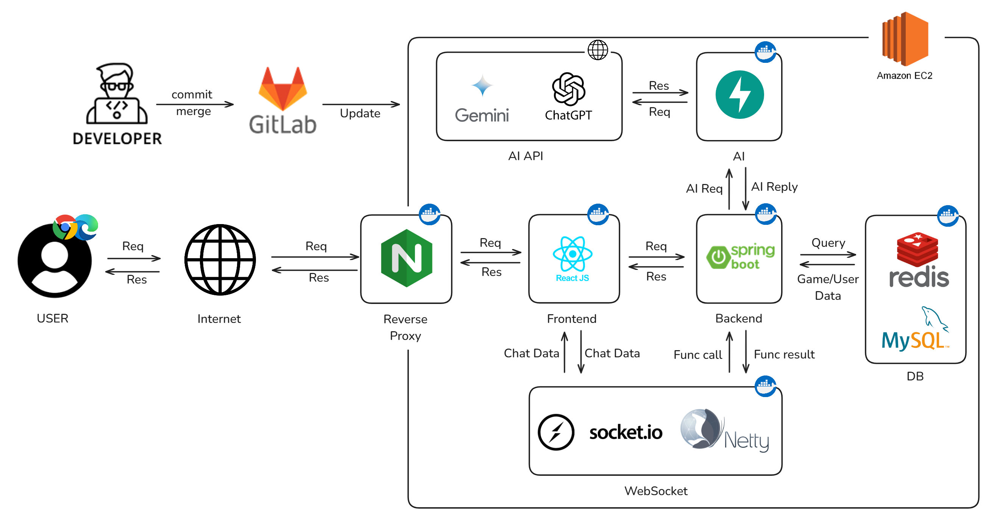

# 🤖 UndAIed

## 개요
프로젝트 명: UndAIed  
프로젝트 기간: 2025.01.02 ~ 2025.02.21  
주제: "어떻게 하면 LLM에 대한 인간 선호도 평가 데이터를 손쉽게 모을 수 있을까?" 에 대한 답변으로, 게이미피케이션 요소를 적용하여 LLM과 마피아게임을 접목한 서비스입니다.  
인원: 6인 (프론트 2인, 백엔드 3인, AI/인프라 1인)  
기여도: 프론트엔드 50%  
프로젝트 주관: 삼성 청년 SW/AI 아카데미  

## 🛠 Skill / Tool
### Skill
&nbsp;&nbsp;&nbsp;&nbsp;&nbsp;&nbsp;&nbsp;&nbsp;<!-- Node.js Badge -->&nbsp;

## Tool
&nbsp;&nbsp;&nbsp;&nbsp;&nbsp;

## 🚀 개발 기능
1. WebSocket 기반 실시간 채팅시스템 구현으로 지연 없는 사용자 상호작용 환경 구축
2. 사용자 프로필 및 게임 전적 관리 기능 구현으로 개인화된 사용자 경험 제공 및 서비스 재방문 유도
3. 운영 공지 및 버그 리포트 게시판 구현으로 사용자와의 소통 구조를 정립하고 이슈 대응 효율 향상
4. BGM 및 효과음 제어 기능 구현으로 게임 상황에 맞는 사운드 연출 제공 및 몰입감 강화
5. 게임 흐름에 맞춘 UI 디자인 및 화면 구조 설계를 통해 사용자 조작 복잡도를 낮추고 학습 비용 최소화
  
## 🛠️ 트러블슈팅 및 최적화  
1. **실시간 양방향 통신 아키텍처 구축 및 네트워크 최적화**
    - **문제:** 실시간으로 진행되는 게임 특성상, 기존 HTTP Polling 방식은 불필요한 헤더 오버헤드와 서버 부하를 야기하고 즉각적인 동기화가 어려움
    - **해결:** Socket.io를 도입하여 클라이언트와 서버 간 양방향 통신 채널을 개설하고, 실시간 채팅 로직 최적화
    - **결과:** 네트워크 대기 시간을 최소화하여 끊김 없는 실시간 플레이 환경을 제공하고, 서버 리소스 사용 효율 개선

2. **게이미피케이션 요소를 활용한 몰입형 UX 구현**  
    - **문제:** 정적인 웹 페이지 구조로는 마피아 게임 특유의 긴장감과 몰입감을 전달하기에 한계가 있음  
    - **해결:** 페이지 진입 시 **슬라이딩 애니메이션**과 상황별 BGM 및 효과음을 적용하고, 화면 크기 제어 로직 구현  
    - **결과:** 웹 환경에서도 네이티브 게임 앱과 유사한 인터랙티브 경험을 제공하여 사용자의 긍정적 피드백을 다수 수렴  

## 💻  서비스 화면
### 게임 메인

| 기능               | 화면                                                    |
| ------------------ | ------------------------------------------------------- |
| 실시간 유저 채팅   |            |
| 실시간 대기실 목록 |  |
| 방만들기           |                 |
| 게임 설정          |                    |

### 마이페이지

| 기능        | 화면                                             |
| ----------- | ------------------------------------------------ |
| 프로필 수정 |    |
| 캐릭터 변경 |  |
| 전적 확인   |    |

### 게시판

| 기능                  | 화면                             |
| --------------------- | -------------------------------- |
| 버그리포트 / 공지사항 |  |

## 📋 프로젝트 산출물

- [요구사항 명세서](https://buttoned-countess-f5d.notion.site/17ea4113f52d809b8a7cf9c92eef61f7?pvs=4)
- [API 명세서](https://buttoned-countess-f5d.notion.site/API-182a4113f52d8045a690e75028d96181?pvs=4)
- [ERD](https://www.erdcloud.com/d/BHo42AscKqpZWuGyc)
- [와이어프레임](https://www.figma.com/design/3BDcFYd6wVHXrG2HJMONwI/%EC%99%80%EC%9D%B4%EC%96%B4%ED%94%84%EB%A0%88%EC%9E%84-%EC%84%A4%EA%B3%84?node-id=0-1&p=f&t=BjTtP6xt4aQNF8us-0)
- 시스템 아키텍처  
  

